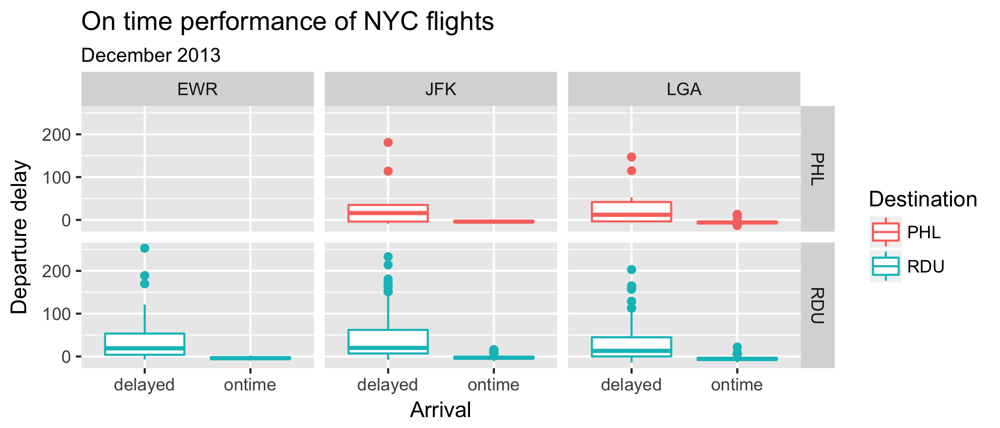

```{r}
#| label: setup
#| include: false

# set the echo option to FALSE to see how the document looks with the code suppressed
knitr::opts_chunk$set(echo = FALSE)
```

## Rules

1.  Your solutions must be written up in the R Markdown (Rmd) file called `exam-01.Rmd`.
    This file must include your code and write up for each task.
    Your "submission" will be whatever is in your exam repository at the deadline.
    Commit and push the Rmd and the md outputs of that file.

2.  This exam is open book, open internet, closed other people.
    You may use any online or book based resource you would like, but you must include citations for any code that you use (directly or indirectly).
    You **may not** consult with anyone else about this exam other than the Professor or TA for this course.
    You cannot ask direct questions on the internet, or consult with each other, not even for hypothetical questions.

3.  You have until **[DUE DATE]** to complete this exam and turn it in via your personal Github repo - late work will **not** be accepted.
    Technical difficulties are **not** an excuse for late work - do not wait until the last minute to knit / commit / push.

4.  Each question requires a (brief) narrative as well as a (brief) description of your approach.
    You can use comments in your code, but do not extensively count on these.
    I should be able to suppress **all** the code in your document and still be able to read and make sense of your answers.
    See the first setup code chunk in your Rmd file to experiment with suppressing and revealing your code.

5.  Even if the answer seems obvious from the R output, make sure to state it in your narrative as well.
    For example, if the question is asking what is 2 + 2, and you have the following in your document, you should additionally have a sentence that states "2 + 2 is 4."

``` r
2 + 2
# 4
```

1.  You may only use `tidyverse` and `nycflights13` (and its dependencies) for this assignment. Your solutions may not use any other R packages.

## Academic Integrity Statement

*I, Kaitlin Buckley, hereby state that I have not communicated with or gained information in any way from my classmates or anyone other than the Professor or TA during this exam, and that all work is my own.*

**A note on sharing / reusing code:** I am well aware that a huge volume of code is available on the web to solve any number of problems.
For this exam you are allowed to make use of any online resources (e.g. StackOverflow) but you must explicitly cite where you obtained any code you directly use (or use as inspiration).
You are also not allowed to ask a question on an external forum, you can only use answers to questions that have already been answered.
Any recycled code that is discovered and is not explicitly cited will be treated as plagiarism.
All communication with classmates is explicitly forbidden.

## Getting help

You are not allowed to post any questions on the public community repo or the public questions channel on Slack.
Any questions about the exam must be asked in person in office hours or on Slack via direct message to the Professor or the TAs.
For quickest response we recommend that you start a direct message with the Professor and all the TAs so that whoever gets to it first can respond to you.

## Grading and feedback

The total points for the questions add up to 90 points.
The remaining 10 points are allocated to code style, commit frequency and messages, overall organization, spelling, grammar, etc.
There is also an extra credit question that is worth 5 points.
You will receive feedback as an issue posted to your repository, and your grade will also be recorded on Sakai.

## Logistics

Answer the questions in the document called `exam-01.Rmd`.
Add your code and narrative in the spaces below each question.
Add code chunks as needed.
Use as many lines as you need, but keep your narrative concise.

Before completing, make sure to supress the code and look over your answers one more time.
If the narrative seems sparse or choppy, edit as needed.
Then, revert back to revealing your code.

Don't forget that you will need to configure your user name and email for Git to be able to push to your repository.

## Packages

In addition to `tidyverse`, you will need the `nycflights13` package for the data.
You will first need to install these packages and then load them.

## The data

The `nycflights13` package contains information about all flights that departed from NYC (e.g. EWR, JFK and LGA) in 2013.
The main data is in the `flights` data frame, but there are additional data sets which may help understand what causes delays, specifically:

-   `weather`: hourly meteorological data for each airport
-   `planes`: construction information about each plane
-   `airports`: airport names and locations
-   `airlines`: translation between two letter carrier codes and names

## Questions

1.  **Question 1 (10 points)** - What are the ten most common destinations for flights from NYC airports in 2013?
    Make a table that lists these in descending order of frequency and shows the number of fligts heading to each airport.

***The ten most common destinations for flights from NYC airports in 2013 were ORD, ATL, 

This code arranged the 10 most visited areas from NYC airports.*** 

flights %>%
  count(dest) %>%
  arrange(desc(n)) %>%
  slice(1:10)


2.  **Question 2 (10 points)** - Which airlines have the most flights departing from NYC airports in 2013?
    Make a table that lists these in descending order of frequency and shows the number of flights for each airline.
 
    flights %>%
  count(carrier) %>%
  arrange(desc(n)) %>%
  inner_join(airlines, by = "carrier")
  
 *** The airline with the most flights departing from NYC airports in 2013 are United Air Lines inc and JetBlue Airways.
    This code arranged the flights by carrier in descending order from their frequency of use.***
    
    In your narrative mention the names of the airlines as well.
    *Hint:* You can use the `airlines` dataset to look up the airline name based on `carrier` code.

3.  **Question 3 (10 points)** - Consider only flights that have non-missing arrival delay information.
    Your answer should include the name of the carrier in addition to the carrier code and the values asked.
    

    flights %>%
  filter(!is.na(arr_delay)) %>%
  group_by(carrier) %>%
  summarise(mean_arr_delay = mean(arr_delay)) %>%
  arrange(desc(mean_arr_delay)) %>%
  inner_join(airlines, by = "carrier") %>%
  slice(c(1, n()))

    a\.
    Which carrier had the highest mean arrival delay?
Fronteir Airlines inc with 21.9 minutes
    b\.
    Which carrier had the lowest mean arrival delay?
Alaska Airlines with 9.93 minutes early

4.  **Question 4 (10 points)** - What was the mean temperature at the origin airport on the day with the highest departure delay?


flights %>%
  arrange(desc(dep_delay)) %>%
  slice(1) %>%
  select(dep_delay, month, day, origin)


The highest departure delay was a flight on Jan 9 departing from JFK.

    Your answer should include the name of origin airport, the date with the highest departure delay, and the mean temperature on that day.

5.  **Question 5 (15 points)** - Consider breaking the day into four time intervals: 12:01am-6am, 6:01am-12pm, 12:01pm-6pm, 6:01pm-12am.

    a\.
    Calculate the proportion of flights that are delayed at departure at each of these time intervals.

flights <- flights %>%
  mutate(time_of_day = case_when(
    sched_dep_time >= 001  & sched_dep_time <= 600  ~ "12:01am-6am",
    sched_dep_time >= 601  & sched_dep_time <= 1200 ~ "6:01am-12pm",
    sched_dep_time >= 1201 & sched_dep_time <= 1800 ~ "12:01pm-6pm",
    sched_dep_time >= 1801                          ~ "6:01pm-12am"
))
***21% of flights are delayed between midnight and 6 am, 26% are delayed between 6am and noon, 52% are delayed between 6pm and midnight.***
    b\.
    Comment on how the likelihood of being delayed change throughout the day?
   
    flights %>%
  filter(!is.na(dep_delay)) %>%
  mutate(dep_delayed = ifelse(dep_delay > 0, "delayed", "ontime")) %>%
  count(time_of_day, dep_delayed) %>%
  group_by(time_of_day) %>%
  mutate(prop_delayed = n / sum(n)) %>%
  filter(dep_delayed == "delayed") %>%
  arrange(prop_delayed)
    
  
    
***As the day goes by, you are less likely to be delayed.***
6.  **Question 6 (15 points)** - Find the flight with the longest air time.


flights %>%
  arrange(desc(air_time)) %>%
  slice(1) %>%
  select(air_time, dest, tailnum) %>%
  inner_join(planes, by = "tailnum") %>%
  select(air_time, dest, tailnum, seats)


    a\.
    How long is this flight?

11.58 hours or 695 minutes.
    b\.
    What city did it fly to?
Honolulu.
    c\.
    How many seats does the plane that flew this flight have?
292 seats. 

7.  **Question 7 (15 pts)** - The `airports` data frame contains information on a large number of primarily American airports.
    These data include location information for these airports in the form of latitude and longitude coordinates.
    In this question we limit our focus to the [Contiguous United States](https://en.wikipedia.org/wiki/Contiguous_United_States).
    Visualize and describe the distribution of the longitudes of airports in the Contiguous United States.
    What does this tell you about the geographical distribution of these airports?
    *Hint:* You will first need to limit your analysis to the Contiguous United States.
    [This Wikipedia article](https://en.wikipedia.org/wiki/List_of_extreme_points_of_the_United_States) can help, but you're welcomed to use other resources as well.

  airports %>%
  filter(
    lat > 24.520833333333332 & lat < 49.38447222222222,
    lon > -124.77169444444445 & lon < -66.94702777777778
  ) %>%
  ggplot(aes(x = lon)) +
    geom_histogram(binwidth = 5)

  
  
    Make sure to cite whatever resource you use.

Source: https://www2.stat.duke.edu/courses/Spring18/Sta199/exam/midterm-01-post.html

8.  **Question 8 (15 pts)** - Recreate the plot included below using the `flights` data.
    Once you have created the visualization, in no more than one paragraph, describe what you think the point of this visualization might be.
    *Hint:* The visualization uses the variable `arrival`, which is not included in the `flights` data frame.
    You will have to create `arrival` yourself, it is a categorical variable that is equal to `"ontime"` when `arr_delay <= 0` and `"delayed"` when `arr_delay > 0`.



**Extra Credit (5 pts)** - Create a visualization that effectively shows if there is a relationship between the average daily departure delay and the average daily temperature for all three New York city airports.
Your answer must be given in a single pipe.
(You should only spend time on this question once you have finished answering the others)